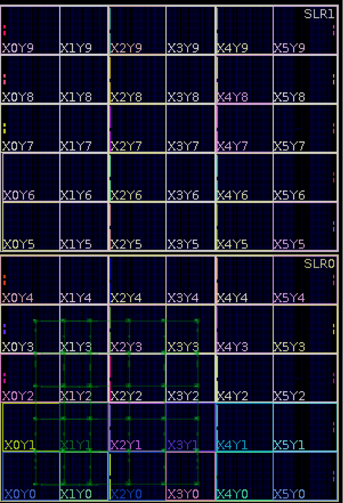

# RapidRoute

We provide RapidRoute, a custom greedy router built on top of the [Xilinx RapidWright](http://www.rapidwright.io) framework for fast assembly of communication networks on Xilinx FPGAs.
> Leo Liu, Jay Weng, Nachiket Kapre
>
> ["RapidRoute: Fast Assembly of Communication Structures for FPGA Overlays"](https://nachiket.github.io/publications/rapid-route_fccm-2019.pdf)
>
> International Symposium On Field-Programmable Custom Computing Machines, Apr 2019

## How to use the tool:
### Installation dependencies
#### MacOS
```
brew install gradle
```
Manually install Java 1.8+ (http://www.oracle.com/technetwork/java/javase/downloads/)

#### Linux (Ubuntu)
```
sudo apt update
sudo apt install default-jre
sudo apt install default-jdk
```

**Vivado 2018.1+ is highly recommended** (https://www.xilinx.com/products/design-tools/vivado.html)

### MacOS and Linux
A setup script is available for integrating with the latest [RapidWright source](https://github.com/Xilinx/RapidWright).
```
sh setup.sh
```

### Generating user-defined overlays
To generate designs, you must have fully-routed DCP modules available to be imported into the design.
As well, the modules should have corresponding `.conf` files.

A few examples are given under the `src/main/resources/default-templates/` directory.

#### Launching RapidRoute
A launch script is available to launch RapidRoute.
RapidRoute can be in either interactive mode, or it can execute your own Python script.
```
./launch.sh [-h] [FILE_NAME] [--interactive]
```
Interactive mode is simply a Jython execution shell with RapidRoute libraries loaded in.

#### Creating custom designs
[Jython](http://www.jython.org) is an included dependency which allows you to access Java objects using our `rapidroute` Python2 module.
You can automate the creation of your custom designs using APIs provided by our included toolkit.

The RapidRoute module is provided in the `rapidroute/` folder.
The module is simply a loose collection of APIs which forward function calls into a Java backend.
For example:
```
from rapidroute.device_toolkit import *

# Initialize RapidRoute with up to 4 threads
init(num_jobs=4)

new_design("example", "xcku115-flva1517-3-e")

# Import a DCP file
add_modules("src/main/resources/default-templates/dcps-xcku115-flva1517-3-e/east_16b.dcp", 16, [], [])

...
place_design()
route_design()
write_checkpoint("example.dcp")
```

The `routing_tests/` folder feature example scripts for generating a single register pair, as well as ring and torus topologies.

**Output DCP files will be in the** `output/` **folder**.

### Example screenshots
6x6 Torus:


### License

This tool is distributed under MIT license.
Copyright (c) 2019 Leo Liu, Jay Weng, Nachiket Kapre
Permission is hereby granted, free of charge, to any person obtaining a copy of this software and associated documentation files (the "Software"), to deal in the Software without restriction, including without limitation the rights to use, copy, modify, merge, publish, distribute, sublicense, and/or sell copies of the Software, and to permit persons to whom the Software is furnished to do so, subject to the following conditions: 

**The above copyright notice and this permission notice shall be included in all copies or substantial portions of the Software.**

THE SOFTWARE IS PROVIDED "AS IS", WITHOUT WARRANTY OF ANY KIND, EXPRESS OR IMPLIED, INCLUDING BUT NOT LIMITED TO THE WARRANTIES OF MERCHANTABILITY, FITNESS FOR A PARTICULAR PURPOSE AND NONINFRINGEMENT. IN NO EVENT SHALL THE AUTHORS OR COPYRIGHT HOLDERS BE LIABLE FOR ANY CLAIM, DAMAGES OR OTHER LIABILITY, WHETHER IN AN ACTION OF CONTRACT, TORT OR OTHERWISE, ARISING FROM, OUT OF OR IN CONNECTION WITH THE SOFTWARE OR THE USE OR OTHER DEALINGS IN THE SOFTWARE.
